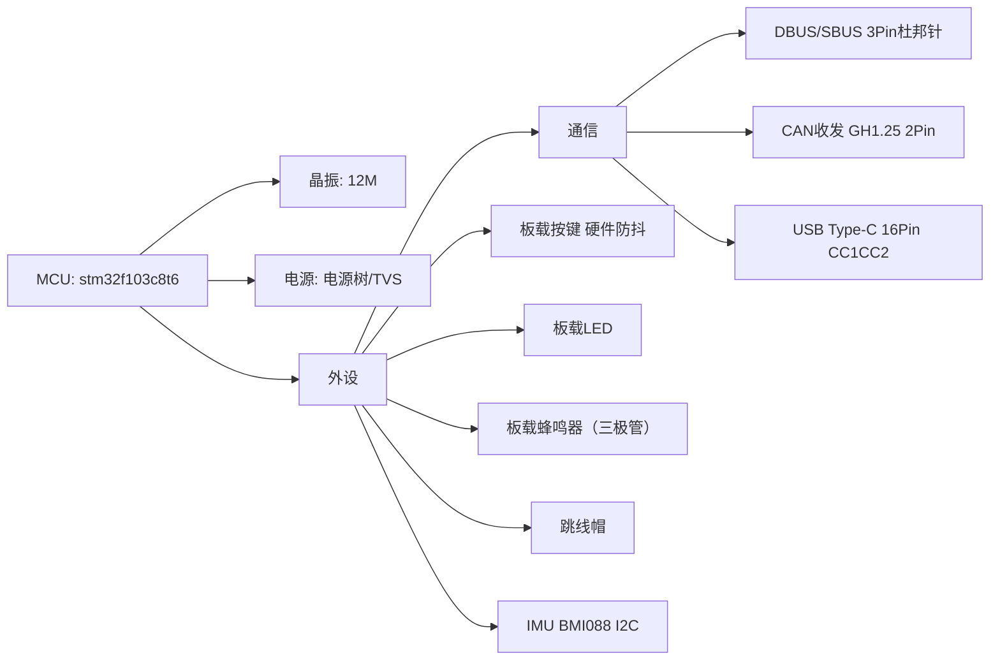
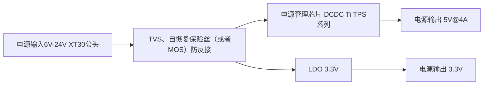

# 工控板
## 用途
1. demo
2. 用于工控，场地道具/培训

## 模块

```mermaid
graph LR
    A[MCU: stm32f103c8t6]
    B[晶振: 12M]
    C[电源: 电源树/TVS]
    D[外设]
    E[通信]
    F[DBUS/SBUS 3Pin杜邦针]
    G[CAN收发 GH1.25 2Pin]
    H[USB Type-C 16Pin CC1CC2]
    I[板载按键 硬件防抖]
    J[板载LED]
    K[板载蜂鸣器（三极管）]
    L[跳线帽]
    M[IMU BMI088 I2C]
    A --> B
    A --> C
    A --> D
    D --> E
    E --> F
    E --> G
    E --> H
    D --> I
    D --> J
    D --> K
    D --> L
    D --> M
```
## 电源树

``` mermaid
graph LR
    A[电源输入6V-24V XT30公头]
    B[TVS、自恢复保险丝（或者MOS）防反接]
    C[电源管理芯片 DCDC Ti TPS系列]
    F[LDO 3.3V]
    D[电源输出 5V@4A]
    E[电源输出 3.3V]
    A --> B
    B --> C
    B --> F
    C --> D
    F --> E
```
